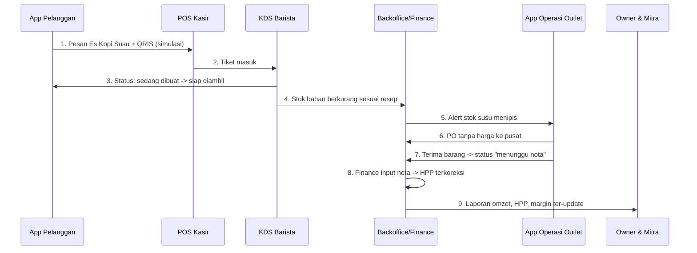
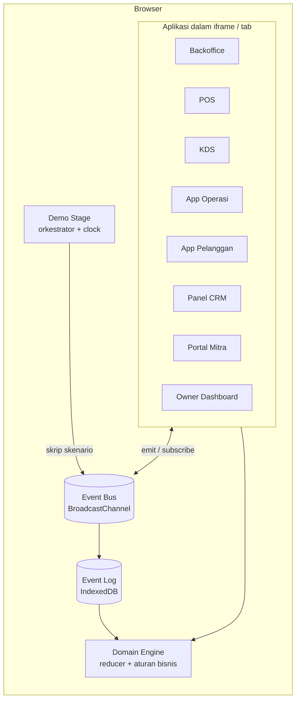

# PRD — Demo Ekosistem Kopi "Satu Gelas, Satu Cerita"

| | |
|---|---|
| **Dokumen** | Product Requirements Document (PRD) |
| **Produk** | Demo interaktif ekosistem ERP & aplikasi untuk bisnis kopi multi-outlet |
| **Versi** | 1.1 (draf) — menambah Design System (light only) |
| **Penulis** | Pradana |
| **Status** | Draf untuk dikerjakan |
| **Bahasa antarmuka** | Indonesia (utama), Inggris (opsional) |

---

## 1. Ringkasan

### 1.1 Latar belakang
Client (perusahaan kopi multi-outlet) sedang dalam tahap penawaran untuk ekosistem aplikasi yang terdiri dari ERP Backoffice, POS Kasir, KDS Barista, App Operasi Outlet, App Pelanggan, Panel Promo CRM, Portal Mitra/Investor, dan Owner Dashboard. Penawaran tertulis saja sulit memperlihatkan **bagaimana semua aplikasi itu saling terhubung**.

### 1.2 Tujuan produk
Membuat **demo interaktif berbasis React** yang memperlihatkan seluruh ekosistem bekerja sebagai satu kesatuan, lewat satu skenario utama: **satu pesanan kopi mengalir dari pelanggan sampai ke laporan owner dan mitra**.

### 1.3 Tujuan bisnis
1. Membuat client yakin bahwa ekosistem ini bisa dibangun dan dipahami sejak sebelum kontrak.
2. Menonjolkan keunggulan rancangan: stok per outlet, pembelian tanpa harga di PO, HPP sementara yang dikoreksi saat nota masuk, persetujuan belanja, promo fleksibel.
3. Memperjelas cakupan dan fase pengerjaan (Fase 1 Core, Fase 2 Omni, Fase 3 Scale) sebagai dasar negosiasi.
4. Menunjukkan bahwa produk dapat dijual lagi ke brand lain (white-label).

### 1.4 Metrik keberhasilan demo

| Metrik | Target |
|---|---|
| Skenario utama dapat dijalankan end-to-end tanpa error | 100% |
| Durasi mode presentasi otomatis | 5–7 menit |
| Waktu muat awal (koneksi 4G) | < 3 detik |
| Seluruh aplikasi P0 bereaksi terhadap satu event dalam | < 300 ms |
| Client dapat menyebutkan peran tiap aplikasi setelah demo | Umpan balik kualitatif saat presentasi |

---

## 2. Ruang Lingkup

### 2.1 Dalam cakupan (demo)
- Seluruh aplikasi pada tabel di Bagian 5, dengan kedalaman berbeda (lihat prioritas).
- Alur lintas aplikasi (Bagian 4) yang saling sinkron secara real-time di browser.
- Data dummy (seed) realistis untuk satu brand fiktif.
- Mode presentasi otomatis, role switcher, peta fase, dan white-label switch.

### 2.2 Di luar cakupan
- Backend, database, autentikasi, dan integrasi nyata (Midtrans dan lainnya). Semua disimulasikan.
- WMS/warehouse pusat. Sistemnya sudah ada di sisi client; demo hanya menampilkannya sebagai pihak eksternal.
- Integrasi API ke aplikasi warehouse pusat. Pembayaran ke pusat dicatat manual di admin.
- **Skema bagi hasil mitra.** Pembahasannya ditunda. Demo hanya menampilkan field persentase kepemilikan (dikosongkan) dan laporan omzet, HPP, serta biaya.
- Aplikasi HR/Payroll. Hanya tampil sebagai kartu "terkunci/rencana" di peta fase.
- Detail perpajakan. Pajak hanya berupa konfigurasi dan tampilan indikatif.
- **Dark mode.** Seluruh aplikasi hanya memakai tema light (lihat Bagian 12).
- Aplikasi native iOS/Android. Di demo, app pelanggan berupa web app (PWA) dalam bingkai perangkat.

### 2.3 Asumsi
- Demo dijalankan di laptop (presentasi) dan opsional di HP/tablet asli dengan browser modern.
- Semua data demo hanya berada di browser (IndexedDB) dan dapat di-reset kapan saja.
- Nama brand di demo fiktif ("Kopi Jodi") dan dapat diganti lewat white-label switch.

---

## 3. Persona dan Peran

| Peran | Aplikasi utama | Tujuan di demo |
|---|---|---|
| **Pelanggan** | App Pelanggan | Memesan, membayar, memantau status, memakai voucher |
| **Kasir** | POS | Menerima pesanan walk-in dan pesanan app, pembayaran, shift |
| **Barista** | KDS | Melihat tiket, membuat minuman, menandai selesai |
| **Store Manager** | App Operasi Outlet, Backoffice (terbatas) | Stok, PO, penerimaan barang, belanja kecil, usulan menu lokal |
| **Admin Pusat** | Backoffice | Master bahan, resep, harga, persetujuan menu lokal, konfigurasi |
| **Finance** | Backoffice (modul Finance) | Input nota, koreksi HPP, hutang ke pusat, approval belanja, ringkasan pajak |
| **Owner / Superadmin** | Owner Dashboard, Backoffice | Pantauan lintas outlet, persetujuan pembelian luar pusat |
| **Mitra / Investor** | Portal Mitra (read-only) | Memantau kinerja outlet miliknya |
| **Marketing** | Panel Promo CRM | Membuat promo/voucher global atau per outlet |

---

## 4. Skenario Utama: "Satu Gelas, Satu Cerita"

Skenario ini adalah tulang punggung demo. Setiap langkah memicu **event** yang diterima aplikasi lain. Mode presentasi menjalankannya otomatis; mode manual membiarkan presenter mengklik sendiri.



### Langkah rinci

| # | Aktor | Aksi | Efek lintas aplikasi |
|---|---|---|---|
| 1 | Pelanggan | Pilih outlet, tambah "Es Kopi Susu" dengan modifier, pakai voucher, bayar QRIS (simulasi) | `OrderPlaced`, `PaymentCaptured`. Harga memakai kenaikan % khusus channel app |
| 2 | Kasir | Tiket pesanan app muncul di POS dengan penanda "Online" | Muncul di antrean POS |
| 3 | Barista | Tiket muncul di KDS, tap "Mulai", lalu "Siap" | `OrderPrepStarted`, `OrderReady`. Status di app pelanggan berubah live |
| 4 | Sistem | Saat pesanan selesai, bahan dikurangi sesuai resep dari stok outlet | `StockConsumed`. Stok di Backoffice dan App Operasi turun |
| 5 | Sistem | Stok susu melewati batas minimum | `LowStockAlert`. Notifikasi di App Operasi dan Backoffice |
| 6 | Store Manager | Buat PO berisi barang dan kuantitas **tanpa harga** | `PORequested` |
| 7 | Store Manager | Terima barang. Stok naik dengan status **menunggu nota**, HPP sementara memakai harga terakhir | `GoodsReceived` |
| 8 | Finance | Input nota/kwitansi dengan harga sebenarnya | `InvoiceEntered`. HPP dikoreksi, hutang ke pusat bertambah |
| 9 | Owner dan Mitra | Dashboard menampilkan omzet, HPP, dan margin yang sudah terkoreksi | Grafik bergerak real-time |

### Skenario tambahan (modul "Sorotan")
Dapat dipicu terpisah dari panel Stage:

- **S-A. Menu lokal:** Store Manager mengusulkan menu khusus outlet, Admin Pusat menyetujui, menu muncul di POS dan App Pelanggan outlet itu saja.
- **S-B. Belanja kecil:** Input di bawah batas langsung tercatat. Di atas batas masuk antrean persetujuan Finance atau pimpinan.
- **S-C. Pembelian luar pusat:** Outlet membeli ke toko lain, status menunggu persetujuan pimpinan sebelum bisa diproses.
- **S-D. Promo:** Marketing membuat voucher global dan satu voucher khusus outlet, efeknya terlihat di keranjang pelanggan.
- **S-E. Pembayaran ke pusat:** Finance mencatat pembayaran periodik/fleksibel ke warehouse pusat, hutang berkurang.
- **S-F. White-label:** Ganti brand (logo, warna, nama) satu klik di seluruh aplikasi.

---

## 5. Daftar Aplikasi, Fase, dan Prioritas

| # | Aplikasi | Fase (penawaran) | Prioritas demo | Perangkat di Stage |
|---|---|---|---|---|
| 1 | **Demo Stage** (shell presentasi) | — | P0 | Laptop |
| 2 | **ERP Backoffice** (+ modul Finance) | Fase 1 | P0 | Browser desktop |
| 3 | **POS Kasir** | Fase 1 | P0 | Tablet landscape |
| 4 | **KDS Barista** | Fase 1 | P0 | Monitor/tablet landscape |
| 5 | **App Operasi Outlet** | Fase 1 | P0 | HP portrait |
| 6 | **App Pelanggan** | Fase 2 | P0 | HP portrait |
| 7 | **Panel Promo CRM** | Fase 2 | P1 | Browser desktop |
| 8 | **Portal Mitra/Investor** | Fase 3 | P1 | Browser desktop |
| 9 | **Owner Dashboard** | Fase 3 | P1 | Browser desktop |
| 10 | **HR/Payroll** | Rencana | P2 (kartu terkunci saja) | — |

Keterangan prioritas: **P0** wajib untuk skenario utama, **P1** wajib untuk demo lengkap, **P2** hanya penanda di peta fase.

---

## 6. Arsitektur Demo

### 6.1 Prinsip
1. **Satu sumber kebenaran: event log.** Semua perubahan berupa event yang diurutkan. State tiap aplikasi dibangun dari event yang sama (event sourcing sederhana), sehingga seluruh aplikasi selalu konsisten.
2. **Aplikasi terpisah secara nyata.** Tiap aplikasi adalah route/modul sendiri yang bisa dibuka mandiri (`?embed=1` untuk tampilan tanpa chrome) dan juga ditanam sebagai iframe di Stage.
3. **Domain terpisah dari UI.** Aturan bisnis (stok, HPP, approval, promo) berada di modul domain murni yang diuji unit, sehingga logikanya bisa dipakai ulang saat sistem asli dibangun.
4. **Adapter data.** UI hanya memanggil repository interface. Di demo implementasinya memori + IndexedDB. Saat produksi diganti API tanpa mengubah UI.

### 6.2 Diagram arsitektur



### 6.3 Sinkronisasi antar aplikasi
- Setiap aplikasi menyimpan replika state dan menerapkan event lewat reducer yang sama.
- Saat aplikasi mengirim event: (1) ditulis ke event log di IndexedDB, (2) disiarkan lewat `BroadcastChannel`, (3) aplikasi lain menerapkannya. Fallback: event `storage` bila `BroadcastChannel` tidak tersedia.
- Saat aplikasi dibuka atau di-refresh, state dibangun ulang dari event log.
- Event memiliki `id` (ULID), `seq`, `ts`, `type`, `actor`, `outletId`, dan `payload`. Pemrosesan bersifat idempoten berdasarkan `id`.
- Demo di beberapa perangkat fisik (HP dan laptop) di luar cakupan P0. Bila dibutuhkan, tambahkan relay opsional (misalnya WebSocket kecil) sebagai P2.

### 6.4 Katalog event

| Konteks | Event |
|---|---|
| Sales | `OrderPlaced`, `PaymentCaptured`, `OrderAccepted`, `OrderPrepStarted`, `OrderReady`, `OrderPickedUp`, `OrderCancelled` |
| Inventory | `StockConsumed`, `StockAdjusted`, `StockOpnameSubmitted`, `LowStockAlert` |
| Procurement | `PORequested`, `POSentToCentral`, `GoodsReceived` (status `awaiting_invoice`), `InvoiceEntered`, `ExternalPurchaseRequested`, `ExternalPurchaseApproved` |
| Finance | `PaymentToCentralRecorded`, `PettyCashSubmitted`, `PettyCashApproved`, `PettyCashRejected`, `HppRecalculated` |
| Catalog | `LocalMenuProposed`, `LocalMenuApproved`, `LocalMenuRejected`, `PriceChanged`, `ChannelMarkupChanged` |
| Promotion | `VoucherCreated`, `VoucherRedeemed`, `CampaignPublished` |
| Platform | `BrandThemeChanged`, `FeatureToggled`, `DemoReset` |

### 6.5 Aturan bisnis yang diterapkan engine

| ID | Aturan |
|---|---|
| BR-01 | Ekosistem berjalan sebagai satu kesatuan (tidak modular), fitur yang tidak terpakai dapat dimatikan lewat feature toggle. |
| BR-02 | Setiap outlet memiliki warehouse/tempat stok sendiri. Master bahan berada di ERP ini (standalone). |
| BR-03 | Outlet berbelanja bahan lewat warehouse pusat, dan tetap dapat membeli ke toko lain. Pembelian luar pusat **wajib persetujuan pimpinan**. |
| BR-04 | PO ke supplier/pusat berisi barang dan kuantitas saja, **tanpa harga**. |
| BR-05 | Penerimaan barang menaikkan stok dengan status "menunggu nota". HPP sementara memakai **harga terakhir**. |
| BR-06 | Saat nota diinput, harga sebenarnya menggantikan harga sementara dan HPP dikoreksi (termasuk atas stok yang sudah terjual bila relevan untuk laporan). |
| BR-07 | Pembayaran ke pusat dicatat manual di Backoffice, dapat periodik atau fleksibel (tidak harus per order), tanpa integrasi ke aplikasi warehouse pusat. |
| BR-08 | Stok berkurang otomatis berdasarkan resep saat pesanan selesai dibuat. Bahan olahan (syrup, cold brew, dll) dapat dibuat di outlet sehingga menjadi bahan setengah jadi dengan resepnya sendiri. |
| BR-09 | Menu lokal/resep khusus outlet diusulkan Store Manager dan disetujui Admin Pusat sebelum aktif. |
| BR-10 | Harga jual **sama di semua channel**, dengan pengaturan kenaikan % khusus channel app order. |
| BR-11 | Promo/voucher fleksibel: global atau per outlet. |
| BR-12 | Belanja kebutuhan kecil outlet memiliki batas nominal (per hari atau per transaksi). Di atas batas wajib persetujuan Finance atau pimpinan. Bila nominal harian sangat besar, perlu persetujuan pimpinan. |
| BR-13 | Biaya operasional seperti gaji diatur oleh pusat. Finance berada di pusat. |
| BR-14 | Kepemilikan outlet (milik sendiri atau mitra) memiliki field persentase kepemilikan. **Disiapkan tetapi dikosongkan** (skema bagi hasil ditunda). |
| BR-15 | Pembayaran pelanggan memakai QRIS lewat Midtrans (disimulasikan di demo). |
| BR-16 | Pajak (PPN dan PPh) berupa konfigurasi, bukan perhitungan penuh di demo. |
| BR-17 | Satu instalasi per brand. Aturan khas client dibuat sebagai konfigurasi atau fitur yang bisa dimatikan. |

---

## 7. Tech Stack

### 7.1 Stack demo (React)

| Lapisan | Pilihan | Alasan |
|---|---|---|
| Bahasa | **TypeScript 5** (strict) | Aman untuk model domain yang kompleks |
| Framework UI | **React 19** | Sesuai kebutuhan |
| Build tool | **Vite** | Cepat, mudah multi-route dan code-splitting |
| Routing | **React Router** (data router) | Satu app, route per aplikasi (`/pos`, `/kds`, dst.) |
| Styling | **Tailwind CSS** + design tokens (CSS variables) | Konsisten dan mudah di-theme untuk white-label |
| Komponen | **shadcn/ui** (Radix UI) + **lucide-react** | Aksesibel dan mudah dikustomisasi |
| Font | **@fontsource-variable/plus-jakarta-sans** + **@fontsource/jetbrains-mono** | Dibundel lokal, demo tetap jalan offline |
| State | **Zustand** + **Immer** | Ringan, cocok untuk reducer berbasis event |
| Event bus | **BroadcastChannel API** (fallback `storage` event) | Sinkron lintas iframe/tab tanpa backend |
| Persistensi | **IndexedDB** via `idb` | Event log dan snapshot tahan refresh |
| Form dan validasi | **React Hook Form** + **Zod** | Form backoffice yang rapi dan tervalidasi |
| Tabel | **TanStack Table** | Tabel data besar di backoffice |
| Grafik | **Recharts** | Dashboard owner, mitra, backoffice |
| Animasi | **Motion (Framer Motion)** | Transisi tiket, alur antar-perangkat, momen "wow" |
| Data dummy | **@faker-js/faker** + seed terketik | Data realistis dan dapat diulang |
| ID | **ulid** | Event terurut dan unik |
| Tanggal/uang | **date-fns**, `Intl.NumberFormat('id-ID')` | Format Indonesia |
| PWA | **vite-plugin-pwa** | App Pelanggan dan KDS terasa seperti app asli, bisa di-install |
| QR | **qrcode.react** | Tampilan QRIS simulasi |
| i18n | **react-i18next** (opsional) | ID dan EN |
| Uji unit | **Vitest** + **Testing Library** | Uji domain engine dan komponen kritis |
| Uji e2e | **Playwright** | Memastikan skenario utama tidak pernah rusak |
| Kualitas kode | **ESLint**, **Prettier**, **Husky** + lint-staged | Konsistensi |
| Hosting | **Cloudflare Pages / Vercel / Netlify** (static) | Cukup statis, tanpa server |

### 7.2 Catatan arsitektur kode
- Pendekatan **Domain-Driven Design** ringan: bounded context `catalog`, `inventory`, `procurement`, `sales`, `promotion`, `finance`, `partnership`. Tiap konteks punya model, event, dan reducer sendiri di modul domain.
- Modul domain **tanpa dependensi React** agar mudah diuji dan dipindahkan ke backend.
- Satu repo, satu aplikasi Vite. Pemisahan lewat folder fitur dan lazy-loaded routes.

### 7.3 Stack produksi (referensi, belum dikunci)
Demo tidak menentukan stack produksi. Sebagai arah awal yang selaras dengan keahlian tim:

| Bagian | Opsi |
|---|---|
| Web (Backoffice, POS, KDS, Portal, Dashboard) | React (lanjutan dari demo) |
| Mobile (App Pelanggan, App Operasi) | Flutter atau React Native |
| Backend | Laravel atau Go (modular monolith, DDD) |
| Database | PostgreSQL (atau MySQL) |
| Realtime (KDS, status pesanan) | WebSocket / SSE |
| Pembayaran | Midtrans (QRIS, e-wallet, kartu) |

Keputusan final dibahas setelah PRD produk dan arsitektur (milestone M6).

---

## 8. Struktur Repository

```
kopi-demo/
├─ src/
│  ├─ apps/
│  │  ├─ stage/            # Shell presentasi, device frame, role switcher, mode auto
│  │  ├─ backoffice/       # ERP + modul Finance
│  │  ├─ pos/
│  │  ├─ kds/
│  │  ├─ outlet-ops/
│  │  ├─ customer/
│  │  ├─ crm/
│  │  ├─ partner/
│  │  └─ owner/
│  ├─ domain/              # Aturan bisnis murni (tanpa React)
│  │  ├─ catalog/  inventory/  procurement/
│  │  ├─ sales/    promotion/  finance/  partnership/
│  │  └─ events.ts         # Definisi dan reducer event
│  ├─ platform/
│  │  ├─ bus.ts            # BroadcastChannel + fallback
│  │  ├─ eventLog.ts       # IndexedDB
│  │  ├─ repository.ts     # Interface data (adapter demo)
│  │  └─ featureToggle.ts  # Feature flags
│  ├─ seed/                # Data dummy brand, outlet, bahan, resep, menu
│  ├─ ui/                  # Komponen bersama, design tokens, tema brand
│  └─ main.tsx
├─ e2e/                    # Playwright: skenario utama
├─ public/
└─ prd.md
```

---

## 9. Persyaratan Fungsional per Aplikasi

Format: **ID — kebutuhan** `[prioritas]`.

### 9.1 Demo Stage (shell presentasi)

| ID | Kebutuhan |
|---|---|
| STG-01 | Tampilan multi-perangkat: bingkai HP, tablet, dan monitor yang menampilkan aplikasi sebagai iframe, dapat diatur ulang layout-nya (grid 2x2, 1+3, fokus satu) `[P0]` |
| STG-02 | **Mode presentasi otomatis** ("Play demo"): menjalankan skenario Bagian 4 dengan jeda, sorotan visual, dan teks narasi di bawah layar `[P0]` |
| STG-03 | Kontrol pemutaran: play, pause, langkah berikutnya/sebelumnya, kecepatan 0.5x/1x/2x `[P0]` |
| STG-04 | Mode manual: presenter mengklik sendiri tiap aplikasi tanpa skrip `[P0]` |
| STG-05 | **Role switcher:** pindah sudut pandang cepat ke peran mana pun `[P0]` |
| STG-06 | Animasi aliran: garis/partikel yang berpindah dari satu perangkat ke perangkat lain saat event terjadi `[P1]` |
| STG-07 | **Peta fase:** tampilkan seluruh aplikasi dengan label Fase 1/2/3 dan estimasi durasi. Aplikasi di luar fase terpilih tampil terkunci `[P1]` |
| STG-08 | **White-label switch:** ganti brand (nama, logo, warna, font) dan seluruh aplikasi berubah `[P1]` |
| STG-09 | Panel "Sorotan" untuk memicu skenario tambahan S-A sampai S-F `[P1]` |
| STG-10 | Log event live (panel samping) untuk menunjukkan apa yang terjadi di balik layar, dapat disembunyikan `[P1]` |
| STG-11 | Tombol **Reset demo** (hapus event log dan muat ulang seed) `[P0]` |
| STG-12 | Kartu "HR/Payroll — rencana" yang terkunci di peta fase `[P2]` |
| STG-13 | Mode layar penuh dan pintasan keyboard untuk presenter `[P1]` |

### 9.2 ERP Backoffice

Navigasi utama: Dashboard, Master Data, Katalog, Inventory, Pembelian, Penjualan, Keuangan, Promo, Persetujuan, Pengaturan.

**Master dan konfigurasi**

| ID | Kebutuhan |
|---|---|
| BO-01 | Master **bahan** (nama, satuan, kategori, stok minimum, harga terakhir) `[P0]` |
| BO-02 | Master **outlet**: nama, alamat, status kepemilikan (milik sendiri atau mitra), **persentase kepemilikan (field ada, nilai kosong)**, jam operasional `[P0]` |
| BO-03 | Master **pengguna dan peran** (owner, admin pusat, Finance, store manager, kasir, barista) dengan matriks hak akses `[P1]` |
| BO-04 | **Feature toggle:** matikan/hidupkan fitur per instalasi dan efeknya langsung terlihat di menu `[P0]` |
| BO-05 | Konfigurasi pajak (PPN dan PPh) sebagai parameter. Perhitungan penuh ditunda `[P2]` |
| BO-06 | Konfigurasi kenaikan % harga untuk channel app order `[P0]` |
| BO-07 | Konfigurasi batas belanja kecil (per hari/per transaksi) per outlet `[P0]` |

**Katalog**

| ID | Kebutuhan |
|---|---|
| BO-10 | Master **menu** (nama, kategori, harga, foto, status) `[P0]` |
| BO-11 | **Resep** per menu (bahan dan kuantitas), mendukung bahan olahan bertingkat `[P0]` |
| BO-12 | **Modifier** (ukuran, level gula, ekstra shot, susu alternatif) dengan dampak harga dan bahan `[P1]` |
| BO-13 | **Perhitungan HPP** per menu dari resep dan harga bahan terkini, dengan margin `[P0]` |
| BO-14 | **Bahan olahan** (syrup, cold brew) dengan resep sendiri, dapat diproduksi di outlet `[P1]` |
| BO-15 | Daftar menu **lokal outlet** beserta antrean persetujuan: setujui/tolak dengan catatan `[P0]` |

**Inventory dan pembelian**

| ID | Kebutuhan |
|---|---|
| BO-20 | **Stok per outlet** (tiap outlet punya tempat stok sendiri) dengan filter outlet, kartu stok, dan penanda stok menipis `[P0]` |
| BO-21 | Stok berstatus **"menunggu nota"** ditampilkan jelas dengan HPP sementara `[P0]` |
| BO-22 | **PO tanpa harga:** daftar PO dari outlet, status (diajukan, dikirim ke pusat, diterima sebagian, diterima, menunggu nota, selesai) `[P0]` |
| BO-23 | **Input nota/kwitansi** (harga per barang, total, lampiran gambar) yang memicu koreksi HPP dan menambah hutang `[P0]` |
| BO-24 | Riwayat koreksi HPP: harga sementara, harga nota, selisih, dampak ke laporan `[P1]` |
| BO-25 | **Pembelian luar pusat** dengan alur persetujuan pimpinan sebelum bisa dilanjutkan `[P1]` |
| BO-26 | Stok opname dan penyesuaian stok dengan alasan `[P1]` |
| BO-27 | Penerimaan sebagian (partial receive) `[P2]` — aturan lengkapnya belum diputuskan, demo hanya menampilkan alur sederhana |

**Keuangan (modul Finance)**

| ID | Kebutuhan |
|---|---|
| BO-30 | **Hutang ke pusat** per outlet: saldo, rincian nota, umur hutang `[P0]` |
| BO-31 | **Catat pembayaran ke pusat** (periodik/fleksibel, alokasi ke beberapa nota) `[P0]` |
| BO-32 | **Antrean persetujuan belanja kecil** di atas batas, dengan setujui/tolak dan catatan `[P0]` |
| BO-33 | Ringkasan **biaya dan HPP** per outlet dan periode (fokus utama: semua HPP dan biaya tercatat) `[P0]` |
| BO-34 | Ringkasan pajak indikatif (PPN/PPh) `[P2]` |
| BO-35 | Biaya operasional pusat: tampilan indikatif, detail pembebanan ke outlet dibahas kemudian `[P2]` |

**Penjualan dan laporan**

| ID | Kebutuhan |
|---|---|
| BO-40 | Daftar transaksi lintas outlet dan channel (POS, app) dengan filter `[P0]` |
| BO-41 | Laporan penjualan per outlet, menu, jam, dan channel `[P0]` |
| BO-42 | Laporan margin (penjualan dikurangi HPP) dan laporan stok `[P1]` |
| BO-43 | Ekspor CSV `[P2]` |

**Promo (ringkas, versi lengkap di CRM)**

| ID | Kebutuhan |
|---|---|
| BO-50 | Daftar promo/voucher aktif (global atau per outlet) `[P1]` |

### 9.3 POS Kasir

| ID | Kebutuhan |
|---|---|
| POS-01 | Login kasir (PIN) dan buka/tutup **shift** dengan kas awal dan akhir `[P1]` |
| POS-02 | Grid menu per kategori dengan pencarian. Hanya menu yang aktif di outlet tersebut `[P0]` |
| POS-03 | Keranjang dengan modifier, catatan, diskon, dan voucher `[P0]` |
| POS-04 | Pembayaran: tunai (hitung kembalian), QRIS (simulasi), kartu/e-wallet (simulasi) `[P0]` |
| POS-05 | Antrean **pesanan app** dengan penanda "Online", terima atau tolak, hitung estimasi waktu `[P0]` |
| POS-06 | Kirim pesanan ke KDS otomatis setelah pembayaran `[P0]` |
| POS-07 | Struk digital (tampilan) dan opsi cetak (simulasi) `[P1]` |
| POS-08 | Riwayat transaksi shift dan pembatalan/refund dengan otorisasi `[P1]` |
| POS-09 | Indikator stok bahan kritis (menu otomatis ditandai habis bila bahan tidak cukup) `[P1]` |
| POS-10 | Mode offline yang disimulasikan (antrean sinkron saat kembali online) `[P2]` |

### 9.4 KDS Barista

| ID | Kebutuhan |
|---|---|
| KDS-01 | Papan tiket per status: Baru, Dibuat, Siap `[P0]` |
| KDS-02 | Kartu tiket: nomor, nama, channel (app/kasir), daftar item dengan modifier, catatan, waktu tunggu `[P0]` |
| KDS-03 | Aksi satu tap: Mulai, Siap, Diambil. Setiap perubahan mengirim event ke POS dan App Pelanggan `[P0]` |
| KDS-04 | Penanda prioritas dan peringatan keterlambatan (warna berubah, target waktu per menu) `[P1]` |
| KDS-05 | Tampilan resep ringkas saat item dibuka (membantu barista baru) `[P1]` |
| KDS-06 | Suara notifikasi tiket baru (dapat dimatikan) `[P1]` |
| KDS-07 | Pembatalan tiket dan penandaan menu habis `[P2]` |
| KDS-08 | Tampilan layar penuh yang cocok untuk monitor dapur `[P0]` |

### 9.5 App Operasi Outlet (Store Manager)

| ID | Kebutuhan |
|---|---|
| OPS-01 | Beranda: ringkasan hari ini (omzet, jumlah pesanan, stok kritis, tugas tertunda) `[P0]` |
| OPS-02 | Daftar stok outlet dengan pencarian dan peringatan stok menipis `[P0]` |
| OPS-03 | **Buat PO** (barang dan kuantitas, tanpa harga) dari stok menipis atau manual `[P0]` |
| OPS-04 | **Terima barang:** pilih PO, konfirmasi kuantitas, foto barang/nota, status menjadi "menunggu nota" `[P0]` |
| OPS-05 | **Belanja kebutuhan kecil:** input nominal, keterangan, foto nota. Di atas batas muncul status "menunggu persetujuan" `[P0]` |
| OPS-06 | **Usulan menu lokal** (nama, resep, harga) beserta status persetujuan `[P0]` |
| OPS-07 | Stok opname terpandu `[P1]` |
| OPS-08 | Catat produksi bahan olahan (syrup, cold brew) di outlet `[P1]` |
| OPS-09 | Pengajuan **pembelian luar pusat** dengan alasan `[P1]` |
| OPS-10 | Laporan harian dan penutupan hari `[P1]` |
| OPS-11 | Notifikasi push (disimulasikan): stok menipis, persetujuan keluar, pesanan online masuk `[P1]` |
| OPS-12 | Jadwal dan absensi staf `[P2]` — belum dibahas, tidak diprioritaskan |

### 9.6 App Pelanggan (iOS dan Android, di demo berupa PWA)

| ID | Kebutuhan |
|---|---|
| CUS-01 | Onboarding singkat, login simulasi (nomor HP + OTP palsu) `[P1]` |
| CUS-02 | Pilih outlet terdekat (daftar dan peta sederhana) dengan jam buka dan status `[P0]` |
| CUS-03 | Katalog menu per kategori dengan foto, harga, dan filter. Menu tampil sesuai outlet terpilih (termasuk menu lokal) `[P0]` |
| CUS-04 | Detail menu dengan modifier dan catatan `[P0]` |
| CUS-05 | Keranjang dengan voucher, rincian harga, dan **kenaikan % channel app** yang transparan `[P0]` |
| CUS-06 | Pembayaran **QRIS simulasi** (tampil kode QR, tombol "simulasikan bayar") `[P0]` |
| CUS-07 | **Pelacak pesanan live:** diterima, sedang dibuat, siap diambil `[P0]` |
| CUS-08 | Riwayat pesanan dan **pesan ulang** `[P1]` |
| CUS-09 | Halaman promo dan voucher saya `[P1]` |
| CUS-10 | Program poin/loyalty sederhana `[P2]` |
| CUS-11 | Notifikasi push (disimulasikan) saat pesanan siap `[P1]` |

### 9.7 Panel Promo CRM

| ID | Kebutuhan |
|---|---|
| CRM-01 | Buat **voucher**: kode, jenis (persen/nominal), batas pemakaian, masa berlaku, minimum belanja `[P0]` |
| CRM-02 | **Cakupan:** global atau pilih outlet tertentu `[P0]` |
| CRM-03 | Pratinjau tampilan promo di App Pelanggan secara langsung `[P1]` |
| CRM-04 | Daftar kampanye dengan status (draf, aktif, berakhir) `[P1]` |
| CRM-05 | Segmen pelanggan sederhana (baru, loyal, tidak aktif) `[P2]` |
| CRM-06 | Statistik pemakaian voucher dan dampak ke omzet `[P1]` |
| CRM-07 | Banner dan konten promo di beranda app pelanggan `[P2]` |

### 9.8 Portal Mitra/Investor (read-only)

| ID | Kebutuhan |
|---|---|
| PRT-01 | Login mitra (simulasi) dan pemilihan outlet miliknya `[P1]` |
| PRT-02 | Ringkasan kinerja: omzet, jumlah transaksi, rata-rata nilai pesanan, tren `[P1]` |
| PRT-03 | Ringkasan **HPP dan biaya** outlet per periode (termasuk status HPP sementara atau terkoreksi) `[P1]` |
| PRT-04 | Laporan dapat diunduh (tampilan PDF simulasi) `[P2]` |
| PRT-05 | Field persentase kepemilikan ditampilkan sebagai "Belum diatur". **Tidak ada perhitungan bagi hasil** `[P1]` |
| PRT-06 | Semua halaman bersifat baca-saja, tidak ada aksi mengubah data `[P0 untuk portal ini]` |

### 9.9 Owner Dashboard

| ID | Kebutuhan |
|---|---|
| OWN-01 | KPI utama lintas outlet: omzet hari ini, bulan ini, margin, jumlah pesanan `[P1]` |
| OWN-02 | Perbandingan outlet (milik sendiri dan mitra) dalam grafik dan peringkat `[P1]` |
| OWN-03 | Peta/daftar outlet dengan status (buka, tutup, stok kritis) `[P1]` |
| OWN-04 | Pusat persetujuan: pembelian luar pusat, belanja kecil besar, menu lokal (ringkas) `[P1]` |
| OWN-05 | Tren penjualan per jam, per hari, per channel `[P1]` |
| OWN-06 | Peringatan: stok kritis, hutang ke pusat, selisih HPP besar `[P1]` |
| OWN-07 | Menu terlaris dan margin tertinggi `[P2]` |

### 9.10 HR/Payroll (rencana)
Hanya kartu terkunci di peta fase (STG-12) dengan keterangan: aplikasi HR terpisah untuk payroll, dibahas pada tahap berikutnya. Tidak ada layar fungsional di demo.

---

## 10. Model Data Demo (ringkas)

| Entitas | Atribut penting |
|---|---|
| `Brand` | id, nama, logo, tema (warna, font) |
| `Outlet` | id, nama, kepemilikan (own/partner), `ownershipPct` (nullable), batas belanja kecil, jam buka |
| `Ingredient` | id, nama, satuan, kategori, stokMin, lastPrice, isPrepared |
| `StockLot` | id, outletId, ingredientId, qty, unitCost, status (`confirmed` atau `awaiting_invoice`) |
| `MenuItem` | id, nama, kategori, harga, scope (global atau outletId), status |
| `Recipe` | menuItemId, baris (ingredientId, qty), modifier terkait |
| `Order` | id, outletId, channel (pos/app), items, subtotal, markupApp, diskon, total, status, timestamps |
| `PurchaseOrder` | id, outletId, sumber (pusat atau luar), items (tanpa harga), status |
| `GoodsReceipt` | id, poId, items, status |
| `Invoice` | id, poId, items (harga), total, lampiran |
| `PettyCash` | id, outletId, nominal, keterangan, status, approver |
| `PaymentToCentral` | id, outletId, nominal, tanggal, alokasi ke invoice |
| `Voucher` | id, kode, jenis, nilai, cakupan, batas, masa berlaku |
| `LocalMenuProposal` | id, outletId, menu, resep, status, catatan |
| `DomainEvent` | id, seq, ts, type, actor, outletId, payload |

### Data seed (brand fiktif "Kopi Jodi")
- **3 outlet:** 1 milik sendiri, 2 milik mitra (persentase kepemilikan kosong).
- **±20 menu:** Es Kopi Susu, Americano, Latte, Cappuccino, Es Kopi Aren, Matcha Latte, Cokelat, Teh Buah, Croissant, dan lainnya, beserta 1–2 menu lokal contoh.
- **±25 bahan:** biji kopi, susu, gula aren, es batu, cup, tutup, sedotan, bubuk matcha, dan lainnya, termasuk bahan olahan (syrup gula aren, cold brew).
- **Riwayat 14 hari** transaksi per outlet agar grafik dashboard terlihat hidup sejak awal.
- **Beberapa PO, nota, dan hutang** contoh untuk modul Finance.
- **Beberapa voucher** global dan per outlet.

---

## 11. Persyaratan Non-Fungsional

| Kategori | Kebutuhan |
|---|---|
| **Performa** | Muat awal < 3 detik (4G). Event bereaksi di seluruh aplikasi < 300 ms. Code-splitting per aplikasi |
| **Keandalan demo** | Skenario utama tidak boleh gagal. Ada tombol reset dan pemulihan dari event log. Uji e2e Playwright wajib lulus sebelum presentasi |
| **Ketahanan jaringan** | Seluruh demo berjalan **tanpa internet** setelah dimuat (aset lokal, tanpa CDN runtime) |
| **Responsif** | Backoffice dan dashboard (desktop), POS dan KDS (tablet landscape), app pelanggan dan operasi (mobile portrait) |
| **Aksesibilitas** | Kontras minimal WCAG AA (Bagian 12.2), navigasi keyboard di Stage dan Backoffice, target sentuh min. 44 px (mobile, Backoffice) dan 56 px (POS, KDS), `prefers-reduced-motion` dihormati |
| **Tema** | **Light saja, tanpa dark mode.** Seluruh warna, logo, dan font lewat design tokens agar white-label berfungsi di semua aplikasi. Kontras minimal sesuai Bagian 12.2 |
| **Lokalisasi** | Format Rupiah, tanggal, dan zona waktu Indonesia (WIB) |
| **Keamanan** | Tidak ada data nyata, tidak ada kredensial atau kunci API di repo. Label "DEMO" jelas |
| **Dapat dipelihara** | TypeScript strict, domain murni dengan cakupan uji unit tinggi, komponen UI bersama |
| **Portabilitas** | Dapat di-deploy statis dan dijalankan lokal dengan satu perintah |

---

## 12. Design System

### 12.1 Prinsip
1. **Light only.** Satu tema terang untuk seluruh aplikasi dan semua panel. Tidak ada dark mode, tidak ada pengalih tema, dan tidak ada varian `dark:`.
2. **Profesional dan tegas.** Permukaan putih dan abu-abu netral yang bersih, satu warna merek (cokelat kopi) sebagai aksen, dan warna status hanya untuk makna.
3. **Kontras cukup.** Teks, batas kontrol, dan status memenuhi WCAG AA (lihat 12.2). Ketegasan visual lebih diutamakan daripada kesan "lembut".
4. **Satu bahasa desain, kerapatan berbeda.** Token dibagi bersama. Backoffice padat, POS dan KDS besar dan lapang, aplikasi mobile ramah jempol.
5. **Warna untuk makna.** Status "menunggu nota", HPP sementara/terkoreksi, dan channel (app/kasir) memakai penanda yang sama di semua aplikasi.
6. **Siap white-label.** Hanya token `brand-*`, logo, dan nama brand yang boleh berubah antar-brand. Warna status dan netral tetap.

### 12.2 Warna (semua nilai di atas latar terang)

Rasio kontras dihitung terhadap pasangan latar yang tertulis. Target: teks ≥ 4.5:1, batas kontrol dan ikon ≥ 3:1.

**Netral dan permukaan**

| Token | Hex | Kegunaan | Kontras |
|---|---|---|---|
| `--bg` | `#F5F6F8` | Latar halaman/aplikasi | — |
| `--surface` | `#FFFFFF` | Kartu, panel, tabel, modal | — |
| `--surface-muted` | `#EDEFF3` | Header tabel, area sekunder, input read-only | — |
| `--border` | `#D5DAE1` | Pemisah kartu dan tabel (dekoratif) | 1.41 vs putih |
| `--border-strong` | `#8A94A3` | Batas input, checkbox, kontrol interaktif | 3.07 vs putih |
| `--text` | `#14181F` | Teks utama | 17.79 vs putih, 16.46 vs `--bg` |
| `--text-secondary` | `#3D4654` | Teks pendukung, label | 9.53 vs putih, 8.82 vs `--bg` |
| `--text-muted` | `#5B6575` | Keterangan, placeholder, metadata | 5.89 vs putih, 5.12 vs `--surface-muted` |

**Merek (brand "Kopi Jodi" — cokelat kopi)**

| Token | Hex | Kegunaan | Kontras |
|---|---|---|---|
| `--brand-50` | `#F8EFE8` | Latar item terpilih, highlight lembut | — |
| `--brand-100` | `#EEDCCB` | Hover item navigasi, latar ilustrasi | — |
| `--brand-600` | `#7A4A2B` | Tombol utama, tautan, tab aktif, ikon aksen | 7.39 (teks putih di atasnya) |
| `--brand-700` | `#5F3820` | Hover/pressed tombol utama, teks di atas `--brand-50` | 10.13 (putih di atasnya), 8.93 di atas `--brand-50` |

**Status**

| Token | Teks/ikon | Latar lembut | Kontras teks | Arti |
|---|---|---|---|---|
| `--success` | `#176B3F` | `#E6F4EC` | 6.54 vs putih, 5.77 vs latar | Berhasil, selesai, HPP terkoreksi, disetujui |
| `--warning` | `#8F5200` | `#FFF3DC` | 6.22 vs putih, 5.66 vs latar | Menunggu, stok menipis, **menunggu nota**, HPP sementara |
| `--danger` | `#B42318` | `#FDECEA` | 6.57 vs putih, 5.75 vs latar | Gagal, ditolak, stok habis, terlambat |
| `--info` | `#1A56B0` | `#E8F0FC` | 7.00 vs putih, 6.10 vs latar | Informasi, **channel app/online** |

Tombol solid status (misalnya "Tolak", "Setujui") memakai warna status sebagai latar dengan teks putih: danger 6.57, success 6.54, info 7.00.

**Aturan pemakaian warna**
- Warna **tidak pernah** menjadi satu-satunya pembawa makna. Selalu sertakan ikon atau teks pada badge status.
- Teks di atas `--brand-600` dan warna status solid selalu putih.
- Latar halaman memakai `--bg`, konten ada di `--surface`. Jangan menumpuk lebih dari dua tingkat permukaan.

**Palet grafik (kategorikal, semua ≥ 3:1 vs putih)**

| Urutan | Hex | Kontras vs putih |
|---|---|---|
| 1 | `#7A4A2B` | 7.39 |
| 2 | `#1A56B0` | 7.00 |
| 3 | `#176B3F` | 6.54 |
| 4 | `#B26A00` | 4.24 |
| 5 | `#7B3FA0` | 6.86 |
| 6 | `#0B7A8A` | 5.04 |

Garis grid grafik memakai `--border`, label sumbu memakai `--text-muted`. Seri yang berdekatan dibedakan juga lewat label langsung atau pola, bukan hanya warna.

### 12.3 Tipografi

| Peran | Font | Catatan |
|---|---|---|
| UI dan judul | **Plus Jakarta Sans** (variable) | Dibundel lokal lewat `@fontsource-variable` |
| Kode, nomor tiket, ID | **JetBrains Mono** | Untuk kode voucher, nomor PO/nota, ID event |
| Angka | Plus Jakarta Sans + `font-variant-numeric: tabular-nums` | Kolom angka rata kanan di tabel dan laporan |

Fallback: `system-ui, -apple-system, "Segoe UI", Roboto, sans-serif`.

**Skala tipografi per aplikasi**

| Level | Backoffice / Portal / Dashboard / CRM | POS | KDS | App Pelanggan & Operasi (mobile) |
|---|---|---|---|---|
| Teks dasar | 14 px / 20 | 16 px / 24 | 18 px / 26 | 16 px / 24 |
| Teks kecil | 12 px / 16 | 14 px / 20 | 16 px / 22 | 13 px / 18 |
| Judul halaman | 24 px / 32, bobot 700 | 22 px / 28, bobot 700 | 28 px / 34, bobot 700 | 22 px / 28, bobot 700 |
| Judul seksi | 16 px / 24, bobot 600 | 18 px / 24, bobot 600 | 20 px / 28, bobot 600 | 17 px / 24, bobot 600 |
| Angka besar (KPI/total) | 28 px, bobot 700 | 32 px, bobot 700 | 36 px (nomor tiket), bobot 800 | 24 px, bobot 700 |

Teks utama memakai bobot 400–500. Label dan tombol bobot 600. Hindari teks di bawah 12 px.

### 12.4 Spasi, bentuk, dan elevasi

| Token | Nilai |
|---|---|
| Grid spasi | Kelipatan 4 px (4, 8, 12, 16, 24, 32, 48) |
| Radius | `sm` 6 px (badge, input kecil), `md` 10 px (tombol, input, kartu kecil), `lg` 14 px (kartu, panel), `xl` 20 px (bingkai perangkat, modal besar) |
| Garis | 1 px `--border` untuk pemisah, 1 px `--border-strong` untuk kontrol |
| Bayangan `sm` | `0 1px 2px rgba(20,24,31,.06)` — kartu |
| Bayangan `md` | `0 4px 12px rgba(20,24,31,.08)` — dropdown, popover |
| Bayangan `lg` | `0 12px 32px rgba(20,24,31,.12)` — modal, bingkai perangkat |
| Fokus | Cincin 2 px `--brand-600` dengan offset 2 px pada semua elemen interaktif |
| Target sentuh | Min. 44 px (mobile dan Backoffice), min. **56 px** di POS dan KDS |

### 12.5 Spesifikasi komponen inti

| Komponen | Spesifikasi |
|---|---|
| **Tombol utama** | Latar `--brand-600`, teks putih, tinggi 40 px (desktop) / 48 px (mobile) / 56 px (POS, KDS). Hover `--brand-700`. Disabled: latar `--surface-muted`, teks `--text-muted` |
| **Tombol sekunder** | Latar putih, batas `--border-strong`, teks `--text`. Hover latar `--surface-muted` |
| **Tombol bahaya/sukses** | Latar `--danger` / `--success`, teks putih |
| **Input** | Latar putih, batas `--border-strong`, radius `md`, label di atas input (bukan hanya placeholder). Error: batas `--danger` + pesan teks + ikon |
| **Badge status** | Latar lembut status + teks status + ikon 16 px, radius `sm`, teks 12 px bobot 600. Contoh: `Menunggu nota` (warning), `Terkoreksi` (success), `Online` (info) |
| **Kartu** | `--surface`, batas `--border`, radius `lg`, bayangan `sm`, padding 16–24 px |
| **Tabel** | Header `--surface-muted` teks `--text-secondary` bobot 600, baris putih dengan pemisah `--border`, hover baris `--brand-50`, angka rata kanan tabular |
| **Navigasi samping (Backoffice)** | Lebar 240 px, latar putih, item aktif latar `--brand-50` + teks `--brand-700` + indikator kiri 3 px `--brand-600` |
| **Tab bar mobile** | 4–5 tab, ikon 24 px + label, tab aktif `--brand-600` |
| **Tiket KDS** | Kartu putih dengan header berwarna menurut status (Baru: `--info`, Dibuat: `--warning`, Siap: `--success`) berteks putih. Nomor tiket besar (36 px mono), item dan modifier jelas, penghitung waktu tunggu. Terlambat: batas `--danger` 2 px + ikon |
| **Kartu menu (POS/pelanggan)** | Foto, nama, harga tabular. Menu habis: opasitas foto dikurangi + badge `Habis` (danger), tidak bisa dipilih |
| **Bottom sheet / modal** | Latar putih, radius `xl` di sudut atas/semua, overlay `rgba(20,24,31,.45)` |
| **Toast/notifikasi** | Latar putih, batas kiri 4 px warna status, ikon + teks, otomatis hilang 5 detik |
| **Empty state** | Ilustrasi garis sederhana (`--text-muted`), judul, satu kalimat penjelas, satu tombol aksi |
| **Skeleton loading** | Blok `--surface-muted` dengan kilau halus. Hormati `prefers-reduced-motion` |

### 12.6 Tata letak khas per aplikasi

| Aplikasi | Pola tata letak |
|---|---|
| **Backoffice** | Sidebar kiri 240 px, topbar dengan pemilih outlet/periode, area konten maks. 1440 px, tabel dan filter di atas, kartu KPI 4 kolom di Dashboard |
| **POS** | Layar terbagi: grid menu (±65%) dan keranjang tetap di kanan (±35%). Tab kategori di atas, tombol bayar besar di dasar keranjang, antrean pesanan online di panel samping yang dapat dibuka |
| **KDS** | Tiga kolom (Baru, Dibuat, Siap) layar penuh, kartu bertumpuk vertikal, tanpa navigasi rumit |
| **App Operasi Outlet** | Satu kolom, tab bar bawah (Beranda, Stok, Pembelian, Persetujuan, Lainnya), kartu tugas di Beranda |
| **App Pelanggan** | Satu kolom, header outlet, kategori horizontal, daftar menu, keranjang melayang di dasar, tab bar (Beranda, Menu, Pesanan, Promo, Akun) |
| **Panel CRM** | Seperti Backoffice, dengan pratinjau app pelanggan dalam bingkai HP di sisi kanan saat membuat promo |
| **Portal Mitra** | Topbar sederhana tanpa sidebar, kartu KPI di atas, grafik dan tabel di bawah, semua baca-saja (tanpa tombol aksi) |
| **Owner Dashboard** | Grid kartu KPI, grafik besar, perbandingan outlet, dan panel persetujuan di kanan |
| **Demo Stage** | Latar `--bg`, bingkai perangkat di tengah, bilah kontrol presenter di bawah, panel log event di sisi yang dapat disembunyikan |

### 12.7 Bingkai perangkat di Stage
- Bingkai HP, tablet, dan monitor digambar dengan SVG/CSS, bezel abu-abu terang (`#E3E6EB`) dengan batas `--border-strong`, radius `xl`, bayangan `lg`.
- Label perangkat di bawah bingkai (misalnya "POS Kasir") berukuran 12 px `--text-secondary`.
- Perangkat yang sedang aktif menerima event diberi cincin 2 px `--brand-600` sesaat.

### 12.8 Gerak dan animasi

| Aturan | Nilai |
|---|---|
| Durasi | 120 ms (hover/tekan), 200 ms (transisi UI), 320 ms (panel/modal), 600–800 ms (aliran event antar-perangkat) |
| Easing | `cubic-bezier(0.2, 0, 0, 1)` untuk masuk, `cubic-bezier(0.4, 0, 1, 1)` untuk keluar |
| Momen utama | Tiket "terbang" dari POS ke KDS, status berubah di HP pelanggan, angka stok turun, grafik owner bergerak |
| Pembatasan | Maksimal satu animasi menonjol pada satu waktu. Tidak ada animasi dekoratif yang berulang terus-menerus |
| Aksesibilitas | Hormati `prefers-reduced-motion`: ganti gerak dengan fade singkat |

### 12.9 White-label (tetap light)
Tema brand kedua untuk menunjukkan produk dapat dijual ke brand lain. Hanya token `brand-*`, logo, nama, dan opsional font display yang berubah.

| Token | Brand A "Kopi Jodi" | Brand B contoh "Teras Kopi" | Kontras brand B |
|---|---|---|---|
| `--brand-50` | `#F8EFE8` | `#E6F4F4` | — |
| `--brand-100` | `#EEDCCB` | `#CCE8E8` | — |
| `--brand-600` | `#7A4A2B` | `#0B6666` | 6.76 (putih di atasnya) |
| `--brand-700` | `#5F3820` | `#084C4C` | 8.66 di atas `--brand-50` |

Brand baru wajib lolos pemeriksaan kontras yang sama (teks putih di atas `--brand-600` ≥ 4.5:1) sebelum ditambahkan ke daftar tema.

### 12.10 Implementasi teknis tema
- Seluruh warna didefinisikan sebagai CSS variables di satu berkas token dan dipetakan ke konfigurasi Tailwind. Tidak ada warna hex yang ditulis langsung di komponen.
- Deklarasikan `color-scheme: light` pada `:root` dan `<meta name="color-scheme" content="light">` agar kontrol bawaan browser (scrollbar, input tanggal) tetap terang walaupun sistem pengguna memakai mode gelap.
- Tidak memakai media query `prefers-color-scheme` dan tidak memakai kelas `dark:`. Tambahkan aturan lint/pemeriksaan CI yang gagal bila `dark:` ditemukan.
- Pergantian brand dilakukan dengan mengganti nilai variabel `brand-*` pada `:root`, tanpa render ulang aplikasi.
- Komponen shadcn/ui disesuaikan: hapus varian dan variabel mode gelap bawaannya.

### 12.11 Panduan UX tambahan
- **Bingkai perangkat** ringan dan realistis, tanpa gambar berat.
- **Narasi** pada mode presentasi: teks pendek di bawah layar yang menjelaskan "apa yang baru saja terjadi dan mengapa penting".
- **Empty, loading, dan error state** dirancang untuk setiap layar karena presenter mungkin berhenti di mana saja.
- **Label "DEMO"** kecil dan jelas di pojok Stage.

---

## 13. Rencana Pengerjaan Demo

| Tahap | Isi | Keluaran |
|---|---|---|
| **D0 — Fondasi** | Setup repo, design tokens, tema brand, event bus, event log, domain engine dasar, seed | Kerangka berjalan, 2 tab saling sinkron |
| **D1 — Alur inti (P0)** | App Pelanggan, POS, KDS, stok dan resep (Backoffice dasar), Stage manual dan reset | Satu pesanan mengalir pelanggan → POS → KDS → stok |
| **D2 — Procurement dan Finance (P0)** | App Operasi (stok, PO, terima barang), Backoffice (PO, nota, HPP, hutang, belanja kecil) | Alur "menunggu nota" sampai HPP terkoreksi |
| **D3 — Presentasi (P0/P1)** | Mode presentasi otomatis, narasi, role switcher, log event, animasi aliran | Skenario utama otomatis 5–7 menit |
| **D4 — Lengkapi ekosistem (P1)** | CRM, Portal Mitra, Owner Dashboard, menu lokal, pembelian luar pusat, panel Sorotan | Seluruh aplikasi hidup |
| **D5 — Polesan** | Peta fase, white-label, uji e2e, performa, aksesibilitas, latihan presentasi | Demo siap tampil |

Urutan tahap menjaga agar sejak D1 sudah ada sesuatu yang bisa ditunjukkan.

---

## 14. Kriteria Penerimaan

### 14.1 Skenario utama (wajib lulus)
- [ ] Pesanan dari App Pelanggan muncul di POS dan KDS tanpa refresh.
- [ ] Perubahan status di KDS tampil di App Pelanggan dan POS.
- [ ] Stok bahan outlet berkurang sesuai resep saat pesanan selesai.
- [ ] Alert stok menipis muncul di App Operasi dan Backoffice.
- [ ] PO dibuat tanpa kolom harga.
- [ ] Penerimaan barang menaikkan stok dengan status "menunggu nota" dan HPP sementara memakai harga terakhir.
- [ ] Input nota mengoreksi HPP, menambah hutang, dan tercermin di dashboard Owner dan Portal Mitra.
- [ ] Mode presentasi otomatis menjalankan seluruh skenario tanpa intervensi.
- [ ] Tombol reset mengembalikan demo ke kondisi awal.

### 14.2 Skenario tambahan
- [ ] Menu lokal diusulkan, disetujui, dan hanya muncul di outlet terkait.
- [ ] Belanja kecil di bawah batas langsung tercatat, di atas batas masuk antrean persetujuan.
- [ ] Pembelian luar pusat tidak bisa diproses sebelum disetujui pimpinan.
- [ ] Voucher global dan per outlet berlaku sesuai cakupan.
- [ ] Pembayaran ke pusat mengurangi hutang dan teralokasi ke nota.
- [ ] White-label switch mengubah tampilan seluruh aplikasi.
- [ ] Portal Mitra sepenuhnya read-only dan tidak menampilkan bagi hasil.

### 14.3 Kualitas
- [ ] Uji e2e Playwright untuk skenario utama lulus.
- [ ] Uji unit domain (stok, HPP, approval, promo) lulus.
- [ ] Demo berjalan offline setelah dimuat.
- [ ] Tidak ada galat di konsol pada skenario utama.
- [ ] Seluruh aplikasi tampil light, termasuk saat sistem pengguna memakai mode gelap. Tidak ada kelas `dark:` di kode.
- [ ] Pemeriksaan kontras (teks ≥ 4.5:1, batas kontrol dan ikon ≥ 3:1) lulus untuk brand A dan brand B.

---

## 15. Risiko dan Mitigasi

| Risiko | Dampak | Mitigasi |
|---|---|---|
| Cakupan demo membengkak (9 aplikasi) | Terlambat siap tampil | Prioritas P0/P1/P2 dan urutan tahap D0–D5. P0 selesai lebih dulu |
| Demo gagal saat presentasi | Kesan buruk | Mode otomatis dari event log, tombol reset, uji e2e, rekaman video cadangan |
| Client mengira demo = produk jadi | Ekspektasi dan harga tidak selaras | Label "DEMO" dan peta fase yang jelas, jelaskan perbedaan simulasi vs sistem nyata |
| Janji fitur yang belum diputuskan (bagi hasil, pajak, penerimaan sebagian) | Perubahan scope kemudian | Tampilkan sebagai "belum diatur" atau indikatif, catat di daftar pertanyaan terbuka |
| Sinkronisasi antar iframe tidak konsisten | Demo tampak rusak | Event sourcing idempoten, satu reducer bersama, uji e2e lintas iframe |
| Browser presentasi tidak mendukung fitur | Demo tidak berjalan | Fallback `storage` event, uji di Chrome dan Safari, siapkan laptop cadangan |

---

## 16. Pertanyaan Terbuka

1. Penerimaan sebagian (partial receive): bagaimana status PO dan HPP sementara diperlakukan? *(M2 dihentikan di titik ini)*
2. Skema bagi hasil mitra dan pembebanan biaya pusat ke outlet. *(ditunda)*
3. Batas nominal belanja kecil: angka awal untuk demo dan siapa penyetuju default (Finance atau pimpinan).
4. Perlukah demo berjalan di beberapa perangkat fisik sekaligus (perlu relay) atau cukup satu laptop?
5. Nama brand dan aset visual yang dipakai di demo: fiktif sepenuhnya, atau memakai identitas client (dengan izin).
6. Apakah ada kebutuhan menampilkan integrasi nyata (misalnya sandbox Midtrans) untuk meyakinkan client, atau cukup simulasi?
7. Kedalaman tampilan HR/Payroll pada penawaran: cukup kartu rencana atau perlu layar contoh?

---

## 17. Lampiran: Peta Fase Penawaran

| Fase | Isi | Estimasi |
|---|---|---|
| **Fase 1 — Core** | ERP Backoffice, POS Kasir, KDS Barista, App Operasi Outlet | 2,5–3 bulan |
| **Fase 2 — Omni** | App Pelanggan (iOS dan Android), Panel Promo CRM | 2 bulan |
| **Fase 3 — Scale** | Portal Mitra/Investor, Owner Dashboard, dan lainnya | 1–1,5 bulan |
