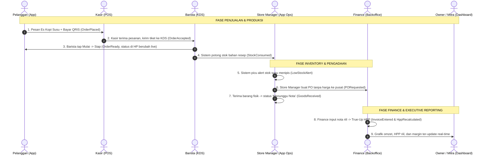

# Skenario Integrasi Lintas Aplikasi (End-to-End Scenarios)

Dokumen ini mendokumentasikan skenario alur kerja lintas aplikasi yang menguji dan mendemonstrasikan bagaimana 9 aplikasi di dalam ekosistem kopi saling berkomunikasi secara real-time melalui event-driven architecture (*BroadcastChannel / IndexedDB*).

---

## 1. Skenario Utama: "Satu Gelas, Satu Cerita"

Skenario ini merupakan tulang punggung demonstrasi ekosistem. Satu cangkir pesanan kopi mengalir mulus melintasi seluruh peran dan aplikasi: dari pemesanan oleh pelanggan, kasir, peracikan barista, pemotongan stok bahan baku, deteksi stok menipis, pengadaan PO tanpa harga, penerimaan barang *menunggu nota*, input nota riil oleh Finance, hingga koreksi HPP (*true-up*) yang tercermin di dashboard Owner dan Portal Mitra.

### 1.1 Diagram Sekuensial (Mermaid)

---

### 1.2 Langkah Alur Rinci Langkah demi Langkah

| Langkah # | Aktor | Aplikasi | Aksi & Interaksi | Event yang Dipancarkan | Dampak Lintas Aplikasi |
|:---:|---|---|---|---|---|
| **1** | Pelanggan | App Pelanggan | Memilih *Kopi Jodi - Sudirman*, menambah *Es Kopi Susu* (dengan modifier *Less Sugar*), menggunakan voucher `HEMAT10`, dan checkout bayar via QRIS simulasi. | `PaymentCaptured` `OrderPlaced` | Pesanan terbit dengan channel `app` dan memicu lonceng notifikasi di tablet POS Kasir outlet Sudirman. |
| **2** | Kasir | POS Kasir | Membuka tab *Pesanan Online*, memeriksa tiket berpenanda badge biru "Online", lalu menekan tombol **Terima Pesanan (Accept)**. | `OrderAccepted` | Status di App Pelanggan berubah menjadi *"Diterima & Disiapkan"*, dan tiket otomatis meluncur ke kolom "Baru" di KDS Barista. |
| **3** | Barista | KDS Barista | Mengetuk **Mulai** (tiket pindah ke kolom "Dibuat"), lalu meracik minuman. Setelah selesai, mengetuk **Siap** (tiket pindah ke kolom "Siap Diambil"). | `OrderPrepStarted` `OrderReady` | HP Pelanggan bergetar membunyikan alert *"Pesanan Siap Diambil!"*. Di POS, status transaksi berubah menjadi *Ready*. |
| **4** | Sistem Domain | Domain Engine | Saat status pesanan menjadi Siap, sistem otomatis membaca formula resep dan memotong saldo stok bahan di outlet Sudirman (kopi: -18 gr, susu: -120 ml, cup: -1 pcs). | `StockConsumed` | Angka stok di Backoffice dan App Operasi Outlet berkurang seketika. |
| **5** | Sistem Domain | Domain Engine | Saldo sisa stok susu melewati batas minimum safety stock (tersisa 3.500 ml < 5.000 ml). | `LowStockAlert` | App Operasi Outlet milik Store Manager membunyikan notifikasi darurat *"Stok Susu Menipis!"*. |
| **6** | Store Manager | App Operasi | Membuka tab pengadaan, memilih bahan Susu Fresh Milk (50 Liter), **tanpa kolom harga**, lalu menekan **Ajukan PO ke Pusat**. | `PORequested` | Dokumen PO tanpa harga masuk ke daftar antrean pengiriman logistik Backoffice Gudang Pusat. |
| **7** | Store Manager | App Operasi | Gudang pusat mengirim barang. Saat fisik tiba di outlet, Manager memeriksa kuantitas fisik (50 L), upload foto surat jalan, lalu menekan **Terima Barang**. | `GoodsReceived` | Stok susu fisik outlet langsung bertambah 50 L dengan status **"Menunggu Nota"** (HPP sementara menggunakan harga terakhir Rp 18.000/L). |
| **8** | Finance | ERP Backoffice | Membuka menu verifikasi nota, memeriksa foto surat jalan, lalu menginput faktur resmi supplier (harga riil naik menjadi Rp 19.500/L). Finance menekan **Konfirmasi & True-Up HPP**. | `InvoiceEntered` `HppRecalculated` | Status stok lot menjadi definitif, HPP pesanan yang terjual dikoreksi otomatis (*variance* disesuaikan), dan hutang outlet ke pusat bertambah Rp 975.000,-. |
| **9** | Owner & Mitra | Owner Dashboard & Portal Mitra | Membuka layar analitik performa cabang. | Data Query Reactive | Grafik omzet, HPP riil definitif, laba kotor, dan saldo hutang bergerak live mencerminkan angka keuangan terkoreksi tanpa bias. |

---

## 2. Skenario Tambahan (Sorotan Fitur / Feature Spotlights)

Selain skenario utama end-to-end, Demo Stage menyediakan panel "Sorotan" untuk menguji kasus-kasus bisnis khas industri kopi multi-outlet:

---

### S-A: Menu Lokal & Kearifan Daerah (Local Signature Menu)
1. **Pengajuan (Store Manager - App Ops)**: Store Manager gerai Sudirman mengajukan menu *Es Kopi Pandan Wangi* seharga Rp 25.000,- beserta formula resepnya (`UC-OPS-07` $\rightarrow$ `LocalMenuProposed`).
2. **Review & Approval (Admin Pusat - Backoffice)**: Admin Pusat meninjau usulan di menu persetujuan dan menyetujuinya (`UC-BO-11` $\rightarrow$ `LocalMenuApproved`).
3. **Hasil Terisolasi**:
   - Menu *Es Kopi Pandan Wangi* langsung muncul di POS Kasir dan App Pelanggan **hanya untuk outlet Sudirman**.
   - Pada outlet Kemang dan Senopati, menu tersebut **tidak muncul**, membuktikan tata kelola menu terpusat yang fleksibel (`BR-09`).

---

### S-B: Belanja Kas Kecil Bertingkat (Tiered Petty Cash Approval)
1. **Kasus 1 (Di Bawah Batas Bebas)**: Store Manager menginput pengeluaran Rp 75.000,- untuk pembelian es batu darurat + foto struk minimarket.
   - *Hasil*: Sistem langsung menyetujui transaksi (`Status: Approved`), saldo kas kecil gerai terpotong, dan dibukukan ke biaya operasional tanpa menunggu kantor pusat (`BR-12`).
2. **Kasus 2 (Melampaui Batas Bebas)**: Store Manager menginput pengeluaran Rp 350.000,- untuk servis mendesak grinder kopi + foto kuitansi bengkel.
   - *Hasil*: Sistem menandai pengajuan berstatus `Awaiting Approval Finance`.
   - *Persetujuan*: Tim Finance memeriksa nota di Backoffice dan menekan **Setujui** (`UC-BO-20` $\rightarrow$ `PettyCashApproved`), barulah kas fisik laci resmi terkredit (`BR-12`).

---

### S-C: Pembelian Bahan Baku di Luar Pusat (External Vendor Purchase)
1. **Pengajuan Darurat (Store Manager - App Ops)**: Stok susu habis total di jam sibuk, mobil pusat tertahan macet banjir. Manager mengajukan izin membeli 20 liter susu di supermarket lokal terdekat (`UC-OPS-06` $\rightarrow$ `ExternalPurchaseRequested`).
2. **Kunci Sistem**: Gerai dilarang keras membeli barang sebelum izin terbit.
3. **Otorisasi Pimpinan (Owner - Dashboard Eksekutif)**: Permohonan masuk ke layar persetujuan Owner (`UC-OWN-03`). Owner meninjau alasan dan menekan tombol **Setujui Pembelian Luar** (`ExternalPurchaseApproved`).
4. **Hasil**: Notifikasi persetujuan muncul di ponsel Manager; Manager membeli susu di supermarket dan mencatatnya sebagai penerimaan barang luar pusat (`BR-03`).

---

### S-D: Promo & Voucher Fleksibel (Global vs Outlet Specific)
1. **Penerbitan Promo (Marketing - Panel CRM)**: Tim marketing menerbitkan 2 kupon:
   - Voucher A: `DISKONSEMUA` (Global untuk seluruh cabang Kopi Jodi).
   - Voucher B: `SUDIRMANSERU` (Eksklusif hanya berlaku di outlet Sudirman) (`UC-CRM-01 & 02`).
2. **Pengujian Keranjang Pelanggan (App Pelanggan)**:
   - Pelanggan yang memilih outlet Sudirman dapat menerapkan kedua voucher tersebut.
   - Pelanggan yang memilih outlet Kemang hanya dapat menerapkan voucher `DISKONSEMUA`. Saat mencoba mengetik `SUDIRMANSERU`, sistem menolak dengan pesan *"Voucher tidak berlaku di outlet ini"* (`BR-11`).

---

### S-E: Pembayaran Hutang ke Pusat Fleksibel (Debt Settlement to Central)
1. **Saldo Hutang Berjalan**: Gerai Sudirman memiliki akumulasi tagihan barang ke gudang pusat sebesar Rp 8.500.000,- dari beberapa penerimaan nota (`UC-BO-18`).
2. **Pencatatan Pembayaran (Finance - Backoffice)**: Gerai Sudirman mentransfer cicilan dana sebesar Rp 5.000.000,- ke rekening kantor pusat.
3. **Alokasi Pelunasan**: Finance menginput bukti transfer dan memilih metode alokasi FIFO (`UC-BO-19` $\rightarrow$ `PaymentToCentralRecorded`).
4. **Hasil**: Faktur pertama lunas penuh, faktur kedua lunas sebagian, dan sisa saldo hutang gerai berkurang menjadi Rp 3.500.000,- tanpa perlu integrasi API ke sistem pergudangan pihak ketiga (`BR-07`).

---

### S-F: White-Label Theme Switcher Instan
1. **Pemicu**: Presenter mendemonstrasikan fleksibilitas komersial sistem di hadapan calon investor.
2. **Aksi**: Presenter memilih pengalih merek dari *Kopi Jodi* (warna cokelat kopi `#7A4A2B`) menjadi *Teras Kopi* (warna toska sejuk `#0B6666`) (`UC-STG-04`).
3. **Hasil Instan**:
   - Event `BrandThemeChanged` disiarkan melalui `BroadcastChannel`.
   - Tanpa me-reload satupun iframe, seluruh tombol, border aktif, logo, dan tipografi di POS Kasir, KDS Barista, App Pelanggan, dan Backoffice berganti warna dan identitas seketika.
   - Seluruh kontras warna tetap memenuhi standar WCAG AA (kontras $\ge 4.5:1$), membuktikan produk 100% siap dijual kembali ke brand kopi lain (`BR-17`).

---

## 3. Matriks Katalog Event Domain (Domain Events Reference)

Tabel berikut menyajikan seluruh katalog event yang menggerakkan integrasi lintas aplikasi:

| Tipe Event | Konteks | Asal Aplikasi | Penerima Utama | Payload Kunci |
|---|---|---|---|---|
| `OrderPlaced` | Sales | POS / App Pelanggan | POS Kasir, KDS Barista | `orderId, channel, items, total, outletId` |
| `PaymentCaptured` | Sales / Gateway | POS / App Pelanggan | POS Kasir, Finance | `orderId, method (cash/qris), amount` |
| `OrderAccepted` | Sales | POS Kasir | App Pelanggan, KDS | `orderId, estimatedMinutes` |
| `OrderPrepStarted` | Kitchen | KDS Barista | App Pelanggan, POS | `orderId, ticketNumber, timestamp` |
| `OrderReady` | Kitchen | KDS Barista | App Pelanggan, POS, Inventory | `orderId, ticketNumber` |
| `OrderPickedUp` | Kitchen / Counter | KDS / POS | App Pelanggan | `orderId, timestamp` |
| `OrderCancelled` | Sales | POS Kasir | App Pelanggan, KDS | `orderId, reason` |
| `StockConsumed` | Inventory | Domain Engine (via KDS) | Backoffice, App Ops | `outletId, orderId, consumedIngredients[]` |
| `LowStockAlert` | Inventory | Domain Engine | App Ops, Backoffice | `outletId, ingredientId, currentQty, minQty` |
| `PORequested` | Procurement | App Ops (Store Manager) | Backoffice Gudang Pusat | `poId, outletId, items (without prices)` |
| `POSentToCentral` | Procurement | Backoffice Gudang Pusat | App Operasi Outlet | `poId, trackingNumber` |
| `GoodsReceived` | Procurement | App Operasi Outlet | Backoffice Finance | `poId, receivedItems[], status: awaiting_invoice` |
| `InvoiceEntered` | Finance | ERP Backoffice (Finance) | Domain Engine, Dashboard | `invoiceId, poId, actualPrices[], totalDebt` |
| `HppRecalculated` | Finance | Domain Engine (True-Up) | Owner & Partner Portal | `outletId, adjustedHpp, dateRange` |
| `ExternalPurchaseRequested`| Procurement | App Operasi Outlet | Owner Dashboard | `requestId, outletId, vendor, estimatedCost` |
| `ExternalPurchaseApproved` | Procurement | Owner Dashboard | App Operasi Outlet | `requestId, approvedBy: "Owner"` |
| `PettyCashSubmitted` | Finance | App Operasi Outlet | Backoffice Finance | `expenseId, outletId, amount, receiptPhoto` |
| `PettyCashApproved` | Finance | Backoffice / Owner | App Operasi Outlet | `expenseId, approvedBy` |
| `PaymentToCentralRecorded` | Finance | ERP Backoffice (Finance) | Partner Portal, Payables | `paymentId, outletId, amount, allocatedInvoices[]` |
| `LocalMenuProposed` | Catalog | App Operasi Outlet | Backoffice Admin | `proposalId, outletId, menuData, recipe` |
| `LocalMenuApproved` | Catalog | Backoffice Admin | POS Kasir, App Pelanggan | `proposalId, menuId, scope: outletId` |
| `VoucherCreated` | Promotion | Panel Promo CRM | App Pelanggan, POS | `voucherId, code, discount, scope (global/outlet)` |
| `BrandThemeChanged` | Platform | Demo Stage Orchestrator | Seluruh 9 Aplikasi | `brandId, themeTokens: {brand600, brand50, logo}` |
| `FeatureToggled` | Platform | ERP Backoffice Config | Seluruh 9 Aplikasi | `featureKey, isEnabled` |
| `DemoReset` | Platform | Demo Stage Orchestrator | Seluruh 9 Aplikasi | `timestamp, seedVersion` |
