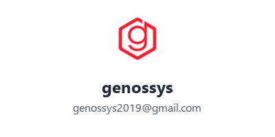

# Proposal Penawaran: Ekosistem Aplikasi Kopi Jodi

<p align="center">
  
</p>

**Dokumen Resmi Penawaran Teknis & Komersial**  
*Versi Ringkas (Executive Summary) — Oktober 2026*  

- **Technology Partner (Pengembang):** **genossys**
- **Email Kontak:** [genossys2019@gmail.com](mailto:genossys2019@gmail.com)
- **Dipersiapkan untuk:** Manajemen & Founder Kopi Jodi  
- **Format Dokumen Resmi:** Markdown (`.md`) dan Microsoft Word (`.docx`) — [Penawaran_Pengembangan_Ekosistem_Aplikasi_Kopi_Jodi.docx](file:///c:/PROJECT/WEBSITE/kopi-jodi/Penawaran_Pengembangan_Ekosistem_Aplikasi_Kopi_Jodi.docx)

---

## 1. Masalah Operasional & Solusi

### Masalah Utama Coffee Shop:
- **Kebocoran Stok Bahan:** Pengurangan bahan baku (biji kopi, susu, sirup, cup) sering tidak sinkron dengan data kasir.
- **HPP Bias:** Nota pembelian fisik outlet sering terlambat atau tidak diverifikasi Finance pusat.
- **Risiko Fraud Kas Kecil:** Pengeluaran darurat outlet belum memiliki batas approval berjenjang.
- **Laporan Cabang Lambat:** Rekap omzet harian dan perhitungan bagi hasil mitra/investor masih manual.

### Solusi Ekosistem Kopi Jodi oleh genossys:
Satu platform terintegrasi (seperti standar Fore / Kopi Kenangan) yang menghubungkan **Kasir POS**, **Layar Barista (KDS)**, **Inventory & Resep Otomatis**, **Approval Pembelian & Kas Kecil**, hingga **Portal Investor**.

---

## 2. Cakupan Modul & Aplikasi

| # | Modul | Platform & Pengguna | Fungsi Utama | Fase |
|---|---|---|---|:---:|
| 1 | **ERP Backoffice** | Web (Owner, Finance, Admin) | Master menu & resep, stok otomatis, verifikasi nota, kas kecil bertingkat, & laba/rugi cabang. | Fase 1 |
| 2 | **POS Kasir** | Tablet / PC (Kasir Outlet) | Transaksi cepat, modifier (ice/sugar/size), kas laci, mode offline, cetak struk, QRIS Midtrans. | Fase 1 |
| 3 | **Layar Barista (KDS)** | Tablet / Monitor (Barista) | Antrean pesanan real-time, status pesanan (*Queue -> In Progress -> Ready*), tanpa kertas bon. | Fase 1 |
| 4 | **App Operasi Outlet** | Mobile Android (Store Manager) | Penerimaan barang (surat jalan), stock opname fisik, pencatatan waste, pengajuan kas kecil. | Fase 1 |
| 5 | **App Pelanggan** | iOS & Android (Pelanggan) | Order online (*Pick-up / Delivery*), QRIS/E-Wallet, poin loyalitas, e-voucher promo. | Fase 2 |
| 6 | **CRM & Promo Panel** | Web (Marketing) | Kelola voucher diskon, blast promo push notification, segmentasi pelanggan. | Fase 2 |
| 7 | **Portal Mitra / Investor** | Web (Investor Cabang) | Laporan real-time: omzet cabang, rincian biaya, HPP riil, dan estimasi bagi hasil. | Fase 3 |
| 8 | **Owner Dashboard & HR** | Web / Mobile (Owner & HR) | KPI konsolidasi seluruh cabang, jadwal shift barista, & absensi GPS karyawan. | Fase 3 |

---

## 3. Fitur Kunci Pengendalian Biaya & Stok (ERP Core)

1. **Pemotongan Stok Otomatis Berbasis Resep:** Tiap transaksi kasir otomatis memotong gramatur kopi, ml susu, sirup, dan cup secara presisi.
2. **Alur Pembelian Transparan (*True-Up HPP*):** Permintaan bahan (tanpa harga) -> Terima barang fisik -> Upload foto nota -> Verifikasi Finance -> HPP riil terkoreksi otomatis.
3. **Approval Kas Kecil Berjenjang:** Nominal kecil (Store Manager), nominal menengah (Finance), nominal besar (Owner) wajib lampirkan foto nota fisik.
4. **Multi-Outlet & Multi-Investor:** Pemisahan pembukuan cabang milik sendiri vs outlet kemitraan/investor secara transparan.

---

## 4. Pilihan Skema Kerjasama & Biaya

Kami menyediakan **2 alternatif skema investasi** yang dapat disesuaikan dengan strategi finansial dan arus kas (*cashflow*) Kopi Jodi:

---

### OPSI 1: Beli Putus — Turnkey Fixed-Price (Disarankan untuk Kepastian Budget Sekali Bayar)

> **Konsep:** Kontrak proyek tuntas berbasis milestone. Sistem diserahterimakan penuh dengan garansi bebas bug dan hak milik source code.

| Paket | Cakupan Modul | Estimasi Waktu | Biaya Standar |
|---|---|:---:|:---:|
| **Fase 1 (Core)** | ERP Backoffice, POS Kasir, KDS Barista, App Operasi Outlet | 2.5 - 3 Bulan | **Rp 75.000.000,-** |
| **Fase 2 (Omni)** | Mobile App Pelanggan (iOS & Android) + Panel Promo CRM | 2 Bulan | **Rp 48.000.000,-** |
| **Fase 3 (Scale)**| Portal Mitra/Investor + Owner Dashboard & HR Shift | 1 - 1.5 Bulan | **Rp 27.000.000,-** |
| **TOTAL NORMAL** | **Seluruh Ekosistem Lengkap (Fase 1 + 2 + 3)** | **± 6 Bulan** | **Rp 150.000.000,-** |
| **PAKET BUNDLING** | **Komitmen Penuh Sekaligus (Fase 1 + 2 + 3)** | **± 6 Bulan** | **Rp 135.000.000,-** *(Hemat Rp 15 Juta)* |

*Fasilitas Beli Putus:* Garansi bug gratis 3-6 bulan, penyerahan full source code, setup deployment cloud, buku panduan (SOP), dan training staf.

---

### OPSI 2: Sistem Bulanan — Dedicated Programmer (Disarankan untuk Cashflow Ringan & Bebas Tambah Fitur)

> **Konsep:** Kopi Jodi memiliki Programmer Dedicated dari **genossys** untuk membangun, merawat, dan mengembangkan ekosistem aplikasi secara berkesinambungan dengan biaya bulanan flat yang sangat ringan.

- **Biaya:** **Rp 5.000.000,- / bulan**
- **Komitmen Kontrak:** **Minimal 5 Tahun (60 Bulan)**
- **Total Nilai Kontrak (5 Tahun):** Rp 300.000.000,- *(dicicil flat Rp 5 Juta per bulan)*
- **Cakupan & Keuntungan:**
  - **Bebas Tambah Fitur Apapun (Unlimited Custom Features):** Kopi Jodi memiliki kebebasan penuh meminta penambahan modul, fitur baru, maupun integrasi sistem apapun tanpa batasan dan **tanpa biaya tambahan (*zero change request fee*)** selama masa kontrak 5 tahun.
  - **Pengembangan Penuh:** Pembangunan seluruh ekosistem aplikasi secara bertahap (Fase 1, Fase 2, hingga Fase 3).
  - **Maintenance & Support Siaga 5 Tahun:** Pemeliharaan sistem, penanganan bug, optimasi performa, dan pemantauan server standby sepanjang masa kontrak oleh tim **genossys**.
  - **Bebas Beban HR & Operasional:** Tidak perlu biaya rekrutmen, THR, BPJS, pesangon, maupun pengadaan laptop kerja developer.
  - **Hak Milik Source Code:** Seluruh kode sumber (*source code*) yang dikembangkan menjadi milik Kopi Jodi.

---

### Perbandingan Cepat: Opsi 1 vs Opsi 2

| Parameter | Opsi 1: Beli Putus (Turnkey Fixed-Price) | Opsi 2: Bulanan (Dedicated Programmer) |
|---|---|---|
| **Beban Cashflow** | Pengeluaran modal per termin proyek | **Sangat Ringan** (Rp 5 Juta / bulan flat) |
| **Masa Komitmen** | Selesai per fase proyek (~3 s/d 6 bulan) | Minimal 5 Tahun (Kerjasama Jangka Panjang) |
| **Maintenance & Update** | Garansi 3 - 6 bulan (setelahnya kontrak maintenance terpisah) | **Gratis & Standby selama 5 Tahun oleh genossys** |
| **Fleksibilitas Fitur** | Fitur terkunci berdasarkan scope dokumen awal | **100% Bebas Tambah Fitur Apapun Kapan Saja** *(Tanpa biaya ekstra)* |
| **Rekomendasi** | **Sangat Tepat jika:** Kopi Jodi memiliki alokasi modal awal dan ingin proyek tuntas dalam target waktu tertentu. | **Sangat Tepat jika:** Kopi Jodi ingin inovasi bebas tanpa batas, butuh tim IT standby, dan ingin cashflow bulanan ringan. |

---

## 5. Estimasi Biaya Pihak Ketiga (Infrastruktur & Lisensi)

Biaya operasional pihak ketiga yang dibayarkan langsung ke penyedia resmi (tanpa markup vendor):

| Komponen Layanan | Penyedia Layanan | Estimasi Biaya | Siklus Pembayaran |
|---|---|:---:|---|
| **Cloud VPS & Database** | DigitalOcean / Lightsail | Rp 600.000 - Rp 1.200.000 / bln | Bulanan (sesuai kapasitas cabang) |
| **Payment Gateway Midtrans** | Midtrans Indonesia | 0.7% per transaksi QRIS | Dipotong per transaksi (tanpa biaya bulanan) |
| **Google Play Developer** | Google LLC | $25 USD (~Rp 400.000) | Sekali bayar seumur hidup (App Android) |
| **Apple Developer Program** | Apple Inc. | $99 USD (~Rp 1.600.000) / thn | Tahunan (App iOS iPhone) |
| **Domain Web & SSL** | Cloudflare / Niagahoster | ~Rp 250.000 / thn | Tahunan (SSL otomatis gratis) |

---

## 6. Timeline Pengerjaan (Fase 1: 12 Minggu)

```
[ Minggu 1 - 2 ]  Finalisasi Alur Operasional, Master Resep, & Desain Database
       │
[ Minggu 3 - 8 ]  Pengembangan Core ERP Backoffice, POS Kasir Tablet, & KDS Barista
       │
[ Minggu 9 - 10]  Integrasi Hardware Kasir (Printer Thermal & QRIS) + Pengujian Sistem
       │
[ Minggu 11 ]     Uji Coba Lapangan (UAT) di 1 Pilot Outlet Kopi Jodi
       │
[ Minggu 12 ]     Pelatihan Karyawan (Training) & Go-Live Resmi
```

---

## 7. Ketentuan Kerjasama & Pembayaran

### A. Skema Beli Putus (Turnkey)
- **Termin 1 (DP 30%):** Saat penandatanganan kontrak kerja (SPK).
- **Termin 2 (Progress 40%):** Setelah modul selesai dan siap UAT di pilot outlet.
- **Termin 3 (Pelunasan 30%):** Setelah UAT disetujui, training selesai, dan sistem live.

### B. Skema Bulanan (Dedicated Programmer)
- Pembayaran dilakukan di awal periode setiap bulan (*in-advance*) sebesar **Rp 5.000.000,-**.
- Masa komitmen kontrak minimal **5 (lima) tahun (60 bulan)**.

---

## 8. Lembar Konfirmasi & Persetujuan

Silakan beri tanda centang `[ √ ]` pada opsi yang dipilih oleh Manajemen Kopi Jodi:

- `[   ]` **OPSI 1: Beli Putus Paket Bundling Penuh (Fase 1 + 2 + 3)** — Rp 135.000.000,- *(Hemat Rp 15 Juta)*
- `[   ]` **OPSI 1: Beli Putus Fase 1 Saja (Core ERP, POS, KDS, Ops)** — Rp 75.000.000,-
- `[   ]` **OPSI 2: Sistem Bulanan Dedicated Programmer** — Rp 5.000.000,- / bulan *(Min. Kontrak 5 Tahun / 60 Bulan, Bebas Tambah Fitur Apapun)*

<br>

| Disetujui Oleh (Klien) | Disiapkan Oleh (Pengembang) |
|:---:|:---:|
| **Manajemen Kopi Jodi** | **genossys**<br>*(Technology Partner)* |
| | **Email:** genossys2019@gmail.com |
| <br><br><br> | <br><br><br> |
| ( ______________________________ ) | ( ______________________________ ) |
| **Jabatan:** Direktur / Owner | **Jabatan:** Lead Solution Architect |
| **Tanggal:** _____ / ____________ / 2026 | **Tanggal:** _____ / ____________ / 2026 |

---
*Dokumen resmi versi Microsoft Word dapat diakses di: [Penawaran_Pengembangan_Ekosistem_Aplikasi_Kopi_Jodi.docx](file:///c:/PROJECT/WEBSITE/kopi-jodi/Penawaran_Pengembangan_Ekosistem_Aplikasi_Kopi_Jodi.docx).*
